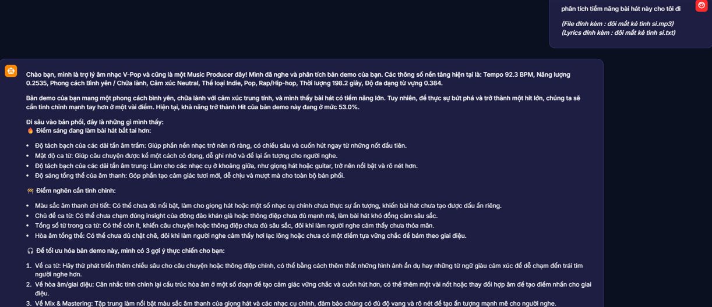
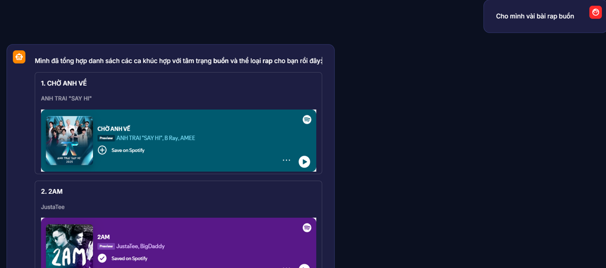

# 🎵 VMusicAI – AI-powered V-Pop Analysis & Recommendation System

> Graduation Project – University of Information Technology (UIT – VNU-HCM)

An end-to-end AI/Data Science platform for analyzing Vietnamese V-Pop songs using Machine Learning, Natural Language Processing (PhoBERT), Explainable AI (SHAP) and Large Language Models (Gemini).

The system integrates predictive analytics, semantic search, and an AI chatbot to support music analysis, hit song prediction, and intelligent user interaction.

---

## 📷 Demo

### Home Page


### Song Analysis



### Recommendation Funtion



---

# 📖 Overview

VMusicAI was developed as an undergraduate graduation project at the University of Information Technology (UIT – VNU-HCM).

The project provides an end-to-end AI/Data Science workflow for Vietnamese V-Pop music analysis, from data collection and preprocessing to model deployment. It combines Machine Learning, Natural Language Processing, Explainable AI, Vector Search and Large Language Models into a single interactive application.

---

# 🌟 Project Highlights

- 🎵 Processed **7,665** Vietnamese V-Pop songs.
- 🤖 Built an AI-powered chatbot using **Gemini API**.
- 🧠 Applied **PhoBERT** for Vietnamese intent classification.
- 📊 Implemented **five Machine Learning tasks** for music analysis.
- 🔍 Developed semantic search using **PostgreSQL + pgvector**.
- 📈 Integrated **SHAP** for model interpretability.
- ⚙ Optimized model performance using **Optuna**.
- 🌐 Deployed the application with **Streamlit**.

---

# 🚀 Key Features

| Module | Description |
|---------|-------------|
| 🎯 Hit Song Prediction | Predict the hit potential of Vietnamese songs |
| 📈 Popularity Prediction | Estimate song popularity using regression models |
| 🎼 Genre Classification | Classify songs into music genres |
| 😊 Emotion Classification | Predict emotional characteristics of songs |
| 📊 Music Style Clustering | Group songs with similar characteristics |
| 🤖 AI Chatbot | Conversational assistant powered by Gemini |
| 🔍 Semantic Search | Retrieve relevant songs using pgvector |
| 📊 Explainable AI | Interpret predictions with SHAP |

---

# 📂 Dataset

The dataset was collected from multiple public music platforms and contains Vietnamese V-Pop songs with metadata, lyrics and audio-related features.

| Dataset | Value |
|----------|------:|
| Songs | 7,665 |
| Artists | 1,668 |
| Numerical Features | 75 |
| Binary Features | 24 |
| One-hot Encoded Features | 3 |
| Evaluation Scenarios | 388 |

The dataset was cleaned, transformed and engineered before training Machine Learning models.

---

# 🏗️ System Architecture

The system consists of four major modules:

- Data Collection & Preprocessing
- Machine Learning
- NLP & Large Language Models
- Streamlit Web Application

Data sources include:

- Spotify API
- Genius Lyrics API
- Vietnamese V-Pop metadata

The processed data are used for feature engineering, Machine Learning, semantic search and chatbot reasoning before being deployed through a Streamlit interface.

---

# 🔄 Machine Learning Pipeline

The project follows a complete end-to-end Machine Learning workflow:

1. Data Collection
2. Data Cleaning
3. Exploratory Data Analysis (EDA)
4. Feature Engineering
5. Model Training
6. Hyperparameter Optimization
7. Model Evaluation
8. Explainability with SHAP
9. Deployment

---

# 🤖 Machine Learning Tasks

| Task | Description |
|------|-------------|
| Hit Song Classification | Predict whether a song has hit potential |
| Popularity Prediction | Predict popularity scores |
| Genre Classification | Predict music genres |
| Emotion Classification | Predict song emotions |
| Music Style Clustering | Discover similar music styles |

---

# 🧠 NLP & Large Language Models

### PhoBERT

- Vietnamese intent classification
- User query understanding
- Context-aware intent detection

### Gemini API

- Conversational AI
- Song explanation
- Recommendation reasoning
- Natural language interaction

### Semantic Search

- PostgreSQL
- Supabase
- pgvector
- Embedding similarity search

---

# 📊 Explainable AI

SHAP is integrated to improve model transparency by providing:

- Global feature importance
- Local prediction explanation
- SHAP Summary Plot
- Individual prediction interpretation

---

# ⚙ Hyperparameter Optimization

Optuna is used to automatically optimize model hyperparameters, improving model performance while reducing manual tuning effort.

---

# 📈 Experimental Results

| Module | Metric | Result |
|---------|---------|------:|
| Intent Classification | Accuracy | **96.90%** |
| Intent Classification | Macro F1-score | **97.32%** |
| Chatbot Evaluation | HitRate@1 | **92.25%** |
| Chatbot Evaluation | Mean Reciprocal Rank | **92.25%** |
| End-to-End Testing | Test Scenarios | **388** |

---

# 💻 Technology Stack

| Category | Technologies |
|-----------|--------------|
| Programming | Python |
| Data Analysis | Pandas, NumPy |
| Machine Learning | Scikit-learn |
| NLP | PhoBERT |
| LLM | Gemini API |
| Explainable AI | SHAP |
| Hyperparameter Optimization | Optuna |
| Database | PostgreSQL, Supabase, pgvector |
| Visualization | Matplotlib, Streamlit |
| Version Control | Git, GitHub |

---

# 📁 Project Structure

```text
VMusicAI
│
├── chatbot/
│   ├── app_chatbot.py
│   ├── action_handler.py
│   ├── analysis_backend.py
│   ├── intent.py
│   ├── nlp.py
│   ├── spotify.py
│   ├── supabase_config.py
│   ├── topic.py
│   ├── requirements.txt
│   ├── .env.example
│   └── .gitignore
├── DA/
│   ├── tasks/
│   │   ├── Genres/
│   │   ├── Hit/
│   │   ├── Popularity/
│   │   ├── Sentiment/
│   │   └── Style/
│   └── utils/
├── dev/
│   ├── run_chatbot.ps1
│   └── setup_venv312.ps1
├── scripts/
│   └── test_case_evalution/
├── images/
├── models/
├── .streamlit/
├── .gitignore
├── requirements-venv312.lock.txt
├── README.md
└── LICENSE
```

---

# 🚀 Getting Started

## Prerequisites

- Python 3.12+
- PostgreSQL
- Supabase
- Gemini API Key

## Installation

```bash
git clone https://github.com/ltlguy214/VMusicAI.git

cd VMusicAI

python -m venv .venv312

# Windows
.venv312\Scripts\activate

pip install -r chatbot/requirements.txt
```

## Environment Variables

```env
SUPABASE_URL=YOUR_SUPABASE_URL
SUPABASE_KEY=YOUR_SUPABASE_KEY
GEMINI_API_KEY=YOUR_GEMINI_API_KEY
```

## Run

```bash
streamlit run chatbot/app_chatbot.py
```

---

# 🚀 Future Work

- Expand the Vietnamese V-Pop dataset.
- Improve recommendation quality.
- Optimize chatbot reasoning.
- Add personalized recommendations.

---

# 👩‍💻 Author

**Lê Trần Thu Huyền**

Information Technology Student

University of Information Technology (UIT – VNU-HCM)

📧 huyen21042003@gmail.com

🔗 GitHub: https://github.com/ltlguy214

---

# 📄 License

This project is licensed under the MIT License.