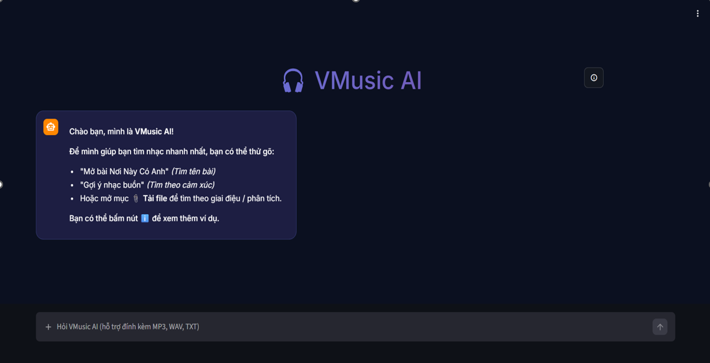

# 🎵 VMusicAI – AI-powered V-Pop Analysis & Recommendation System

> Graduation Project – University of Information Technology (UIT – VNU-HCM)

An end-to-end AI/Data Science platform for analyzing, predicting and recommending Vietnamese V-Pop songs using Machine Learning, Natural Language Processing and Large Language Models.

<p align="center">


</p>
# 📷 Demo

<p align="center">



</p>

### Main Features

- 🎧 Song recommendation
- 📈 Hit song prediction
- 😊 Emotion analysis
- 🎼 Genre classification
- 🤖 AI Chatbot
- 🔎 Semantic search
- 📊 Interactive dashboards

# 📖 Project Overview

VMusicAI is an end-to-end AI/Data Science platform developed as a graduation project at the University of Information Technology (UIT – VNU-HCM).

The project aims to assist users in analyzing and discovering Vietnamese V-Pop songs by combining Machine Learning, Natural Language Processing (NLP), Explainable AI and Large Language Models.

Unlike traditional music recommendation systems, VMusicAI provides intelligent explanations, semantic search and conversational interactions through an AI chatbot.

The system covers the complete AI workflow, including:

- Data Collection
- Data Cleaning
- Exploratory Data Analysis (EDA)
- Feature Engineering
- Machine Learning
- NLP
- Explainable AI
- Deployment
# 🚀 Key Features

## 🎯 Machine Learning

- Hit Song Classification
- Popularity Prediction
- Music Style Clustering
- Emotion Classification
- Genre Classification

---

## 🤖 AI Chatbot

- Gemini API
- PhoBERT Intent Classification
- Context-aware conversations
- Prompt Engineering

---

## 🔍 Semantic Search

- PostgreSQL
- pgvector
- Vector Embedding
- Similarity Search

---

## 📊 Explainable AI

- SHAP
- Feature Importance
- Model Interpretation

---

## ⚡ Hyperparameter Optimization

- Optuna
- Automatic parameter tuning

# 📂 Dataset

The project collected and processed Vietnamese V-Pop songs from multiple public music sources.

| Item | Value |
|-------|--------|
| Songs | 7,665 |
| Features | 17+ |
| Genres | Multiple |
| Artists | Hundreds |
| Lyrics | Vietnamese |
| Test Scenarios | 388 |


# Hit Songs DA – Chatbot (Streamlit)

## Yêu cầu
- Windows 10/11
- Python **3.12.x** (repo này bạn đang chạy với `3.12.10` trong `.venv312`)
- (Khuyến nghị) Git, PowerShell 5+.

## Cách chạy nhanh (giống môi trường `.venv312`)
### 1) Tạo môi trường & cài deps
Chạy một lần:

```powershell
./dev/setup_venv312.ps1
```

Nếu venv bị lỗi/cài dang dở, rebuild sạch:

```powershell
./dev/setup_venv312.ps1 -Recreate
```

Tuỳ chọn cài đúng phiên bản như máy bạn (lockfile):

```powershell
./dev/setup_venv312.ps1 -UseLock
```

### 2) Tạo file cấu hình `.env`
Repo cần một số biến môi trường (Supabase/Gemini/Spotify…). **Không commit key thật**.

- Copy file mẫu:

```powershell
Copy-Item chatbot/.env.example chatbot/.env
```

- Mở `chatbot/.env` và điền các giá trị thật.

Nếu bạn chỉ muốn mở UI để xem, có thể tạm thời tắt Supabase:

```env
SUPABASE_DISABLED=true
```

### 3) Chạy app

```powershell
./dev/run_chatbot.ps1
```

Hoặc thủ công:

```powershell
./.venv312/Scripts/python.exe -m streamlit run chatbot/app_chatbot.py
```

## Ghi chú
- **Supabase**: để các chức năng search/playlist/history chạy đầy đủ, cần `SUPABASE_URL` và `SUPABASE_KEY` hợp lệ.
- **Models**: mặc định có thể dùng local trong `DA/models/` hoặc tải từ Supabase Storage tuỳ biến env (`MODELS_PREFER_STORAGE`, `SUPABASE_MODELS_BUCKET`, ...).
- **FFmpeg** (khi dùng các tính năng audio): nếu gặp lỗi decode audio, cài FFmpeg và thêm vào PATH (hoặc đảm bảo có `ffmpeg.exe` trong máy).

## Troubleshooting nhanh
- Nếu cài `torch` trên Windows quá lâu: thử cập nhật pip trước (`python -m pip install -U pip`) rồi chạy lại setup.
- Nếu bạn thấy warning kiểu `Ignoring invalid distribution ~treamlit` trong máy hiện tại: tạo venv mới và cài lại từ đầu thường sẽ hết.
